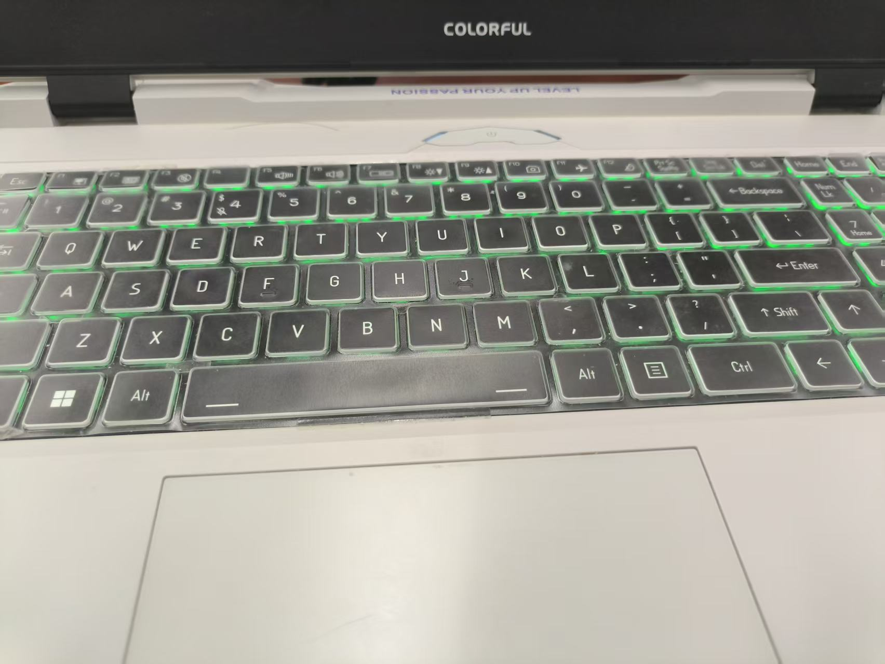

# Colorful / Clevo RGB Keyboard Driver for Linux

七彩虹、Clevo（蓝天模具）游戏本的 Linux 键盘 RGB 背光驱动与图形控制工具。

Linux RGB keyboard backlight driver and GUI controller for Colorful laptops based on Clevo barebones.



## 项目简介

本项目解决七彩虹隐星 P15 2024 在 Linux 下缺少官方键盘背光驱动、驱动无法加载以及新型号背光设备无法注册的问题。

项目基于修改后的 `tuxedo-keyboard` 驱动，将键盘背光注册为标准 Linux LED 设备：

```text
/sys/class/leds/rgb:kbd_backlight
```

配套工具提供：

- 图形化 RGB 灯效控制
- 流光彩虹、呼吸和静态灯效
- 系统托盘和用户级 systemd 后台服务
- Fedora/RHEL 与 Debian/Ubuntu 安装流程
- RPM、DEB 和 DKMS 打包
- 新 Clevo 模具背光规格调试

## 兼容性

| 笔记本型号 | Clevo 模具 | 发行版 | 内核 | 状态 |
| --- | --- | --- | --- | --- |
| 七彩虹隐星 P15 2024 | V250RND | Fedora 44 x86_64 | 7.1.x | 已验证 |
| 其他 V250RND 同模具机型 | V250RND | 未验证 | 未验证 | 理论兼容，需要用户反馈 |

目前只有表中第一项经过实际验证。内核驱动存在硬件风险，请确认模具型号，并准备从 TTY 或恢复模式卸载模块后再尝试。

如果你的设备可以使用，欢迎通过 [硬件兼容性报告](https://github.com/FuHao0119/colorful-laptop-clevo-keyboard/issues/new?template=hardware-compatibility.yml) 提交型号和系统信息，帮助完善兼容性列表。

## 快速开始

### 下载发布版本

推荐从 [GitHub Releases](https://github.com/FuHao0119/colorful-laptop-clevo-keyboard/releases/latest) 下载 `colorful-keyboard` 和对应驱动包。

```bash
chmod +x colorful-keyboard
./colorful-keyboard
```

GUI 可以检测系统、安装构建依赖和驱动，并配置灯效。如果自动安装失败，请使用下面的手动方式。

### 从源码运行 GUI

```bash
git clone https://github.com/FuHao0119/colorful-laptop-clevo-keyboard.git
cd colorful-laptop-clevo-keyboard
python3 -m pip install PyQt5
python3 gui/main.py
```

## 安装驱动

### Fedora / RHEL

安装仓库中已有的 RPM：

```bash
sudo dnf install ./tuxedo-keyboard-3.2.10-1.noarch.rpm
```

或者本地构建：

```bash
sudo dnf install -y make gcc rpm-build dkms kernel-devel-$(uname -r)
make clean
make package-rpm
sudo dnf install ./tuxedo-keyboard-3.2.10-1.noarch.rpm
```

### Debian / Ubuntu

```bash
sudo apt install -y make gcc dpkg-dev dkms linux-headers-$(uname -r)
make clean
make package-deb
sudo apt install ./tuxedo-keyboard-*.deb
```

安装新内核后需要有匹配的内核头文件，DKMS 才能重新构建驱动。

## 系统配置

### 开机加载模块

```bash
sudo tee /etc/modules-load.d/tuxedo_keyboard.conf << 'EOF'
tuxedo_keyboard
uniwill_wmi
clevo_wmi
clevo_acpi
tuxedo_io
EOF
```

### 非 Root 灯效控制

以下规则会允许本机用户写入匹配的键盘背光设备。多用户环境中请根据自己的安全需求收紧权限。

```bash
sudo tee /etc/udev/rules.d/99-kbd-backlight.rules << 'EOF'
SUBSYSTEM=="leds", KERNEL=="*kbd_backlight*", RUN+="/bin/sh -c 'chmod -R a+w /sys/class/leds/%k'"
EOF

sudo udevadm control --reload-rules
sudo udevadm trigger
```

## 灯效脚本

```bash
chmod +x ./light-control-scripts/kbd_light_show.py

# 流光彩虹
./light-control-scripts/kbd_light_show.py --mode rainbow --speed 1.5

# 呼吸灯
./light-control-scripts/kbd_light_show.py --mode breath --color blue --speed 1.2

# 静态灯光
./light-control-scripts/kbd_light_show.py --mode solid --color cyan --brightness 180
```

## GUI 与后台服务

GUI 基于 Python 3 和 PyQt5，支持系统托盘、灯效预览和用户级 systemd 服务。

后台模式通过 `--daemon` 启动，并读取：

```text
~/.config/colorful-keyboard/config.json
```

GUI 运行时会暂停后台服务，防止多个进程同时写入背光设备；GUI 退出后会恢复服务。

开发和打包：

```bash
python3 -m pip install PyQt5 pyinstaller
cd gui
python3 -m PyInstaller colorful-keyboard.spec
```

构建结果位于 `gui/dist/`。

## 适配新型号

如果你的电脑也是 Clevo 模具但没有识别出背光设备，可以收集驱动日志：

```bash
sudo modprobe -r tuxedo_keyboard clevo_wmi clevo_acpi
sudo modprobe tuxedo_keyboard dyndbg=+p
sudo modprobe clevo_wmi
sudo modprobe clevo_acpi
sudo dmesg -w | grep -E "tuxedo|clevo"
```

提交 Issue 前请隐藏序列号、用户名和其他隐私信息。不要只粘贴截图，尽量附上可搜索的文本日志。

## 故障排查

确认背光设备是否注册：

```bash
ls /sys/class/leds
```

查看模块状态：

```bash
lsmod | grep -E "tuxedo|clevo|uniwill"
```

查看 DKMS 状态：

```bash
dkms status
```

卸载本项目模块：

```bash
sudo modprobe -r tuxedo_io uniwill_wmi clevo_wmi clevo_acpi tuxedo_keyboard
```

## 参与贡献

- 新设备请使用硬件兼容性 Issue 模板。
- Bug 报告请附发行版、内核版本、Clevo 模具型号、安装方式和相关日志。
- 欢迎提交对其他 Colorful/Clevo 型号的支持和文档补充。
- 如果项目解决了你的问题，可以给仓库一个 Star，让更多相同硬件的 Linux 用户找到它。

## 许可证与来源

本项目基于 `tuxedo-keyboard` 相关驱动代码修改，并按照 [GPL-3.0 License](LICENSE) 发布。
